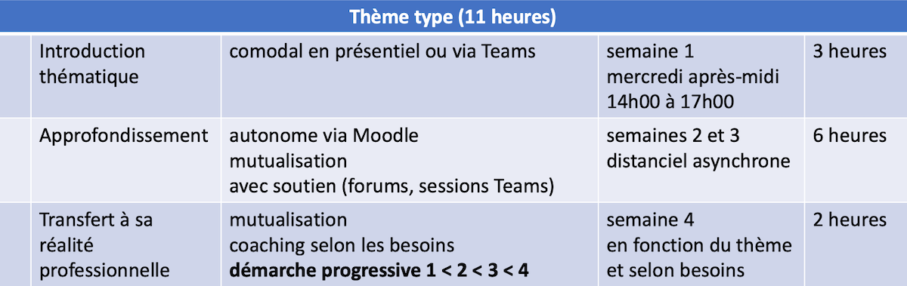

```{r setup, include=FALSE}
options(htmltools.dir.version = FALSE)
knitr::opts_chunk$set(
  fig.width = 9, fig.height = 3.5, fig.retina = 3,
  out.width = "100%",
  cache = FALSE,
  echo = TRUE,
  message = FALSE,
  warning = FALSE,
  fig.show = TRUE,
  hiline = TRUE
)
```

```{r xaringan-themer, include=FALSE, warning=FALSE}
library(xaringanthemer)
style_duo_accent(
  primary_color = "#D2202B",
  secondary_color = "#D2202B",
  inverse_header_color = "#FFFFFF",
  link_color = "#676C72",
    header_font_google = google_font("Josefin Sans")

)
```

class: title-slide, inverse, bottom
background-image: url(`r rmarkdown::metadata$url_unsplash`)
background-size: cover

# `r rmarkdown::metadata$title`

## `r rmarkdown::metadata$subtitle`

### `r rmarkdown::metadata$team`

### `r rmarkdown::metadata$date`

---
class: about-me, middle, center


## Formation continue HEP-VS

[`r icons::fontawesome("user-lock")` Stockage et versioning du projet (Intranet HEP-VS uniquement)](`r rmarkdown::metadata$url_intranet`)</br>
[`r icons::fontawesome("link")` Concept au 26.11.2021 (Equipe Teams de la formation)](`r rmarkdown::metadata$url_concept_up_to_date`) </br>
[`r icons::fontawesome("link")` Canal Teams (Groupe consultatif de la formation)](`r rmarkdown::metadata$url_canal_gc`)</br>
[`r icons::fontawesome("link")` Archive des présentations publiées](`r rmarkdown::metadata$url_archives`)

---
class: inverse, middle left

# Ordre du jour

--

### 1- Accueil

--

### 2- Commande par le client - Cadre de fonctionnement

--

### 3- Missions du GC - Marge de manœuvre

--

### 4- Design de la formation - Prise de position

--

### 5- Contenus - Adéquation avec le métier

--

### 6- Divers

---

class: middle left

# 1- Accueil

--

### Composition du GC

- Manuella Salamin (AMES), Olivier Solioz (SPVal), David Rey (AVECO)

--


### Cahier des charges du GC (extrait)

Avec une voix consultative, le GC...

- ...se prononce sur le déroulement de la formation
- ...propose des régulations
- ...soutient l’amélioration continue du dispositif

--

### Modalités de fonctionnement du GC

- 2 rencontres par an en comodal avec espace de collaboration virtuel

---

class: middle left, inverse

# 2- Commande par l'OES (le client) - Cadre de fonctionnement

--

### Formation obligatoire

--

### 44 heures d'exposition aux contenus

--

### Orientation terrain valaisan

--

### En 4 thèmes avec alternance comodal - asynchrone - personnel

--

### Généraliste


---

class:middle, center

```{r out.width = '100%', echo=FALSE}
# local
knitr::include_graphics("img/org.png")
```
### Organes et pouvoir décisionnel

---

class: middle

# 3- Missions du GC - Marge de manœuvre

--

### Prendre position sur le design de la formation : 

- 3 sessions à choix, 4 thèmes spécifiques, utilisation des technologies
- Utilisation d'un LMS (Moodle) pour assurer une autonomie dans la formation
- Orientation vers l'implémentation en terrain valaisan via la construction d'un outil mutualisable (projet)

--

### Prendre position sur les contenus optimisés par le conseil scientifique :
(sous réserve de modifications lors de la séance du CS du 01.12.2021)

- Eléments de psychologie cognitive : Attention, mémoire, fonction exécutives
- TSA et neurosciences : du diagnostic aux interventions
- Eléments de sciences affectives : développement émotionnel et compétences psychosociales
- Développer un projet d'intervention : outils, risques et opportunités


---

class: title-slide, inverse, middle
background-image: url("https://images.unsplash.com/photo-1523726491678-bf852e717f6a?ixlib=rb-1.2.1&ixid=MnwxMjA3fDB8MHxwaG90by1wYWdlfHx8fGVufDB8fHx8&auto=format&fit=crop&w=2670&q=80")
background-size: cover

--

# 4- Design de la formation - Prise de position

---
class:middle, center
```{r out.width = '100%', echo=FALSE}
# local
knitr::include_graphics("img/sessions.png")
```

### Organisation des sessions et planification des thèmes

---
class:middle, center

```{r out.width = '100%', echo=FALSE}
# local

```
### Anatomie d'un thème

---

class:middle

# 4- Design de la formation - Prise de position

--
### Mission

Commenter le design de formation

--

### Tâches relatives - Lister les risques et opportunités sur :

1. la technologie utilisée
1. l'autonomie des personnes
1. la pédagogie générale
1. la construction d'un délivrable

--

### Document de travail

[Document de travail pour l'élaboration des commentaires sur le design](https://bit.ly/3I6aesT)

---
class: title-slide, inverse, middle
background-image: url("https://images.unsplash.com/photo-1503676260728-1c00da094a0b?ixlib=rb-1.2.1&ixid=MnwxMjA3fDB8MHxwaG90by1wYWdlfHx8fGVufDB8fHx8&auto=format&fit=crop&w=2622&q=80")
background-size: cover

--

# 5- Contenus - Prise de position sur l'adéquation avec le métier

---
class: middle

# 5- Contenus - Prise de position sur l'adéquation avec le métier

--

### Mission

Challenger l'adéquation des contenus avec le métier

--

### Tâches relatives

- Formuler des points de vigilance

--

### Document de travail

[Document de travail pour le challenge des contenus](https://bit.ly/3p6x7ni)

---
class: middle

# 6- Divers

---

class: middle

## Merci pour votre engagement !

```{r out.width = '10%', echo=FALSE}
# local
knitr::include_graphics("img/logo.png")
```

--

.pull-right[

Crédits photo par ordre d'apparition :

[Binh Dang Nam](https://unsplash.com/photos/bzK0qeeoBJo)

[Med Badr Chemmaoui](https://unsplash.com/photos/ZSPBhokqDMc)

[Element5 Digital](https://unsplash.com/photos/OyCl7Y4y0Bk)

]
